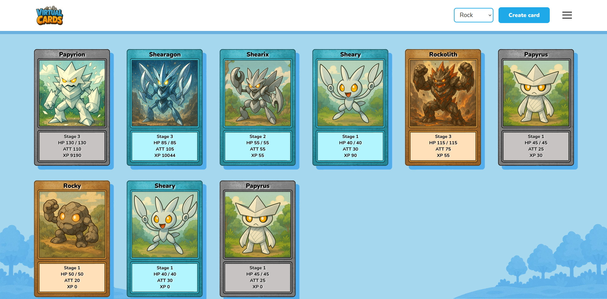

# Virtual Cards

This project is the final assignment for the Backend Development course in Java and Spring Framework at IT Academy Barcelona. It puts together the knowledge I've been learning through the course to create a webapp with CRUD, security and roles with JWT.


## Game overview 



Virtual Cards is a simple game that allows users to create cards of different types (rock, paper and scissors), engage in battles with them, upgrade them, and evolve them. Each card type has its own strengths and weaknesses, following the classic rock-paper-scissors mechanics.

## Technologies used

For the backend:
- Java 21
- Spring Boot 3.2.5
- MySQL
- Gradle
- Swagger

For the frontend:
- React
- Vite
- Css


## AI use

The IA chosen to aid in the project was ChatGPT and a custom GPT was created. It was given general instructions like an overview of what needed to be done, a rule to avoid giving code unless specifically asked, and a focus on providing guidance instead. There was also a work plan that was updated regularly so it would know what had already been completed, along with other useful info.

The backend was handled by the student, while the frontend and design work were expected to be done by the AI, based on the directions it was given.


## Endpoints

Endpoints can be checked with Swagger (OpenAPI) after running the backend

http://localhost:8080/swagger-ui/index.html


## How to run the program

- Make sure you have the technologies used for the project installed.
- Run the following commands, each of them in their corresponding folders (both the backend repo but also the frontend one).

To run the backend go to the project folder, open a terminal and run

```bash
./gradlew bootRun
```

To run the frontend go to the project folder, open a terminal and run

```bash
npm run dev
```

You'll be able to see it at

http://localhost:5173/login
